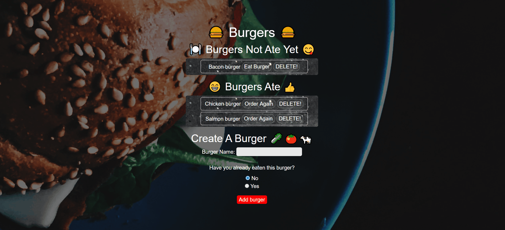

# Eat-Da-Burger

## View Demo Now! ➡️ https://pacific-tundra-39372.herokuapp.com/
## View Repo ➡️ https://github.com/Adambear1/Eat-Da-Burger

## Features 
* jQuery
* mySQL
* ORM
* Bootswatch
* Handlebars

## Usage
* Able to track burgers that you want to eat, or have already eaten. 
* Ability to update burger, create, and delete as well.
* Simple application to utilize components of CRUD (Create Read Update Delete) and to show versatility of handlebars as server rendering.
